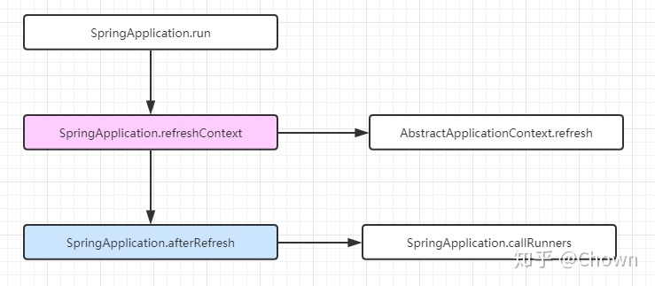
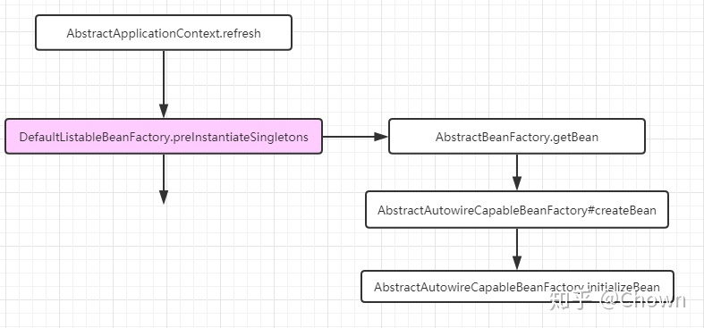

[主页](http://vonzhou.com)  | [读书](https://github.com/vonzhou/readings)  | [知乎](https://www.zhihu.com/people/vonzhou) | [GitHub](https://github.com/vonzhou)
---
# Spring Boot 执行初始化逻辑的方法
---
在 Spring Boot 启动后执行一些初始化的逻辑有哪些方法？它们的执行顺序是怎样的？

## 序

在 Spring Boot 启动后执行一些初始化的逻辑应该是一个很常见的场景，这里总结下几种方法，及执行的顺序。


## init-method

给bean配置init-method属性，或者在xml配置文件中指定，或者指定注解 Bean 的 `initMethod` 属性。

## InitializingBean

实现 `InitializingBean` 接口。

## 使用 PostConstruct 注解

在初始化方法上加 `PostConstruct` 注解。

## Spring Boot 中的 ApplicationRunner/CommandLineRunner

实现 `ApplicationRunner` 或 `CommandLineRunner` 接口。

## 运行效果

我们的基本类：

```java
public class Foo implements InitializingBean, CommandLineRunner, ApplicationRunner {
    public void init() {
        System.out.println("init method ...");
    }

    @PostConstruct
    public void postConstruct() {
        System.out.println("init by PostConstruct ...");
    }

    @Override
    public void afterPropertiesSet() throws Exception {
        System.out.println("init afterPropertiesSet ...");
    }

    @Override
    public void run(String... args) throws Exception {
        System.out.println("init by CommandLineRunner ...");
    }

    @Override
    public void run(ApplicationArguments args) throws Exception {
        System.out.println("init by ApplicationRunner ...");
    }
}
```

引入这个bean。

```java
@Configuration
public class BeanConfig {

    @Bean(initMethod = "init")
    public Foo foo() {
        return new Foo();
    }
}
```

运行输出：

```java
init by PostConstruct ...
init afterPropertiesSet ...
init method ...

init by ApplicationRunner ...
init by CommandLineRunner ...
```


## 执行顺序源码分析


Spring Boot 应用启动（`SpringApplication.run`）后会先加载初始化 Spring 应用上下文（refresh），然后会调用 Spring Boot 引入的运行器（runner）： `ApplicationRunner` 和 `CommandLineRunner`，本质上 `ApplicationRunner` 和 `CommandLineRunner` 并没有什么区别。



```java
private void callRunners(ApplicationContext context, ApplicationArguments args) {
	List<Object> runners = new ArrayList<Object>();
	runners.addAll(context.getBeansOfType(ApplicationRunner.class).values());
	runners.addAll(context.getBeansOfType(CommandLineRunner.class).values());
	AnnotationAwareOrderComparator.sort(runners);
	for (Object runner : new LinkedHashSet<Object>(runners)) {
		if (runner instanceof ApplicationRunner) {
			callRunner((ApplicationRunner) runner, args);
		}
		if (runner instanceof CommandLineRunner) {
			callRunner((CommandLineRunner) runner, args);
		}
	}
}
```

所以 Spring 中的初始化机制会先执行。接下来看看 `init-method，InitializingBean，PostConstruct` 的执行顺序。



bean在实例化之后会进行初始化操作，即 initializeBean ，从`invokeInitMethods`方法中我们可以看到 InitializingBean 接口方法先执行，然后是配置的 init-method 方法。


```java
protected Object initializeBean(final String beanName, final Object bean, RootBeanDefinition mbd) {
	if (System.getSecurityManager() != null) {
		AccessController.doPrivileged(new PrivilegedAction<Object>() {
			@Override
			public Object run() {
				invokeAwareMethods(beanName, bean);
				return null;
			}
		}, getAccessControlContext());
	}
	else {
	    // 如果这个bean实现了一些Aware接口，则将对应的对象设置给他
		invokeAwareMethods(beanName, bean);
	}

	Object wrappedBean = bean;
	if (mbd == null || !mbd.isSynthetic()) {
		wrappedBean = applyBeanPostProcessorsBeforeInitialization(wrappedBean, beanName);
	}

	try {
	    // 这里
		invokeInitMethods(beanName, wrappedBean, mbd);
	}
	catch (Throwable ex) {
		throw new BeanCreationException(
				(mbd != null ? mbd.getResourceDescription() : null),
				beanName, "Invocation of init method failed", ex);
	}

	if (mbd == null || !mbd.isSynthetic()) {
		wrappedBean = applyBeanPostProcessorsAfterInitialization(wrappedBean, beanName);
	}
	return wrappedBean;
}
```

```java
protected void invokeInitMethods(String beanName, final Object bean, RootBeanDefinition mbd)
		throws Throwable {

	boolean isInitializingBean = (bean instanceof InitializingBean);
	if (isInitializingBean && (mbd == null || !mbd.isExternallyManagedInitMethod("afterPropertiesSet"))) {
		if (logger.isDebugEnabled()) {
			logger.debug("Invoking afterPropertiesSet() on bean with name '" + beanName + "'");
		}
		if (System.getSecurityManager() != null) {
			try {
				AccessController.doPrivileged(new PrivilegedExceptionAction<Object>() {
					@Override
					public Object run() throws Exception {
						((InitializingBean) bean).afterPropertiesSet();
						return null;
					}
				}, getAccessControlContext());
			}
			catch (PrivilegedActionException pae) {
				throw pae.getException();
			}
		}
		else {
		    // 如果实现了 InitializingBean 接口
			((InitializingBean) bean).afterPropertiesSet();
		}
	}

	if (mbd != null) {
	    // 如果配置了 init-method
		String initMethodName = mbd.getInitMethodName();
		if (initMethodName != null && !(isInitializingBean && "afterPropertiesSet".equals(initMethodName)) &&
				!mbd.isExternallyManagedInitMethod(initMethodName)) {
			invokeCustomInitMethod(beanName, bean, mbd);
		}
	}
}
```

那么为何 `PostConstruct` 注解会先执行呢？源于 `PostConstruct` 注解是基于 `BeanPostProcessor`实现的，即 `InitDestroyAnnotationBeanPostProcessor`。

```java
@Override
public Object postProcessBeforeInitialization(Object bean, String beanName) throws BeansException {
	LifecycleMetadata metadata = findLifecycleMetadata(bean.getClass());
	try {
		metadata.invokeInitMethods(bean, beanName);
	}
	catch (InvocationTargetException ex) {
		throw new BeanCreationException(beanName, "Invocation of init method failed", ex.getTargetException());
	}
	catch (Throwable ex) {
		throw new BeanCreationException(beanName, "Failed to invoke init method", ex);
	}
	return bean;
}

public void invokeInitMethods(Object target, String beanName) throws Throwable {
	Collection<LifecycleElement> initMethodsToIterate =
			(this.checkedInitMethods != null ? this.checkedInitMethods : this.initMethods);
	if (!initMethodsToIterate.isEmpty()) {
		boolean debug = logger.isDebugEnabled();
		for (LifecycleElement element : initMethodsToIterate) {
			if (debug) {
				logger.debug("Invoking init method on bean '" + beanName + "': " + element.getMethod());
			}
			element.invoke(target);
		}
	}
}
```

这个 `BeanPostProcessor` 首次执行的时候利用反射去寻找这个bean中定义的生命周期元数据，即 `PostConstruct，PreDestroy` 注解标注的方法。


```java
private LifecycleMetadata findLifecycleMetadata(Class<?> clazz) {
	if (this.lifecycleMetadataCache == null) {
		// Happens after deserialization, during destruction...
		return buildLifecycleMetadata(clazz);
	}
	// Quick check on the concurrent map first, with minimal locking.
	LifecycleMetadata metadata = this.lifecycleMetadataCache.get(clazz);
	if (metadata == null) {
		synchronized (this.lifecycleMetadataCache) {
			metadata = this.lifecycleMetadataCache.get(clazz);
			if (metadata == null) {
			    // 双重检查
				metadata = buildLifecycleMetadata(clazz);
				this.lifecycleMetadataCache.put(clazz, metadata);
			}
			return metadata;
		}
	}
	return metadata;
}

private LifecycleMetadata buildLifecycleMetadata(final Class<?> clazz) {
	final boolean debug = logger.isDebugEnabled();
	LinkedList<LifecycleElement> initMethods = new LinkedList<LifecycleElement>();
	LinkedList<LifecycleElement> destroyMethods = new LinkedList<LifecycleElement>();
	Class<?> targetClass = clazz;

	do {
		final LinkedList<LifecycleElement> currInitMethods = new LinkedList<LifecycleElement>();
		final LinkedList<LifecycleElement> currDestroyMethods = new LinkedList<LifecycleElement>();

		ReflectionUtils.doWithLocalMethods(targetClass, new ReflectionUtils.MethodCallback() {
			@Override
			public void doWith(Method method) throws IllegalArgumentException, IllegalAccessException {
				if (initAnnotationType != null) {
					if (method.getAnnotation(initAnnotationType) != null) {
						LifecycleElement element = new LifecycleElement(method);
						currInitMethods.add(element);
						if (debug) {
							logger.debug("Found init method on class [" + clazz.getName() + "]: " + method);
						}
					}
				}
				if (destroyAnnotationType != null) {
					if (method.getAnnotation(destroyAnnotationType) != null) {
						currDestroyMethods.add(new LifecycleElement(method));
						if (debug) {
							logger.debug("Found destroy method on class [" + clazz.getName() + "]: " + method);
						}
					}
				}
			}
		});

		initMethods.addAll(0, currInitMethods);
		destroyMethods.addAll(currDestroyMethods);
		targetClass = targetClass.getSuperclass();
	}
	while (targetClass != null && targetClass != Object.class);

	return new LifecycleMetadata(clazz, initMethods, destroyMethods);
}
```

上述代码中出现的初始化注解类型 initAnnotationType，销毁注解类型 destroyAnnotationType 目前来看就是 PostConstruct 和 PreDestroy，可以从 
`CommonAnnotationBeanPostProcessor`（继承了 	`InitDestroyAnnotationBeanPostProcessor`）的构造器中看到，可以看到这个代码的可扩展性很好。

```java
public CommonAnnotationBeanPostProcessor() {
	setOrder(Ordered.LOWEST_PRECEDENCE - 3);
	setInitAnnotationType(PostConstruct.class);
	setDestroyAnnotationType(PreDestroy.class);
	ignoreResourceType("javax.xml.ws.WebServiceContext");
}
```
	
	

	

## 总结


